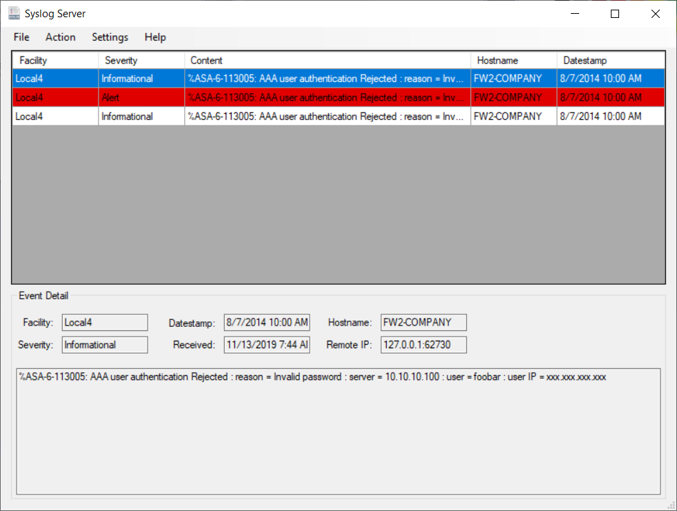

# Syslog-Server
Syslog Server with SSL receive, Sqlite database and TLS e-mail
This is a combination of the Syslog Server from https://github.com/mguinness/syslogserver
and a couple of project from here: https://github.com/jchristn (SqliteWrapper and SimpleTCP)
and the Aegis Implicit Mail (AIM) from https://github.com/nilnull/AIM

